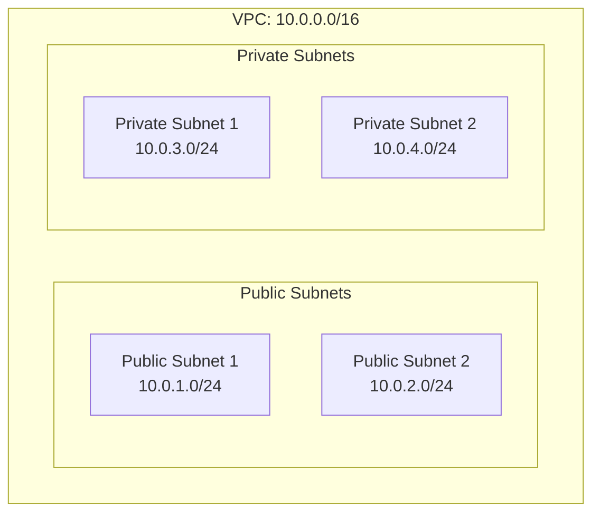

# ECS Advanced Networking Workshop - Improved Structure

## Tổng quan cải tiến

Workshop đã được tái cấu trúc thành các trang nhỏ hơn, dễ theo dõi với các tính năng tương tác và format code được cải thiện.

## Cấu trúc mới

### 1. Introduction (1-introduction/)
- `_index.md` - Tổng quan workshop

### 2. Prerequisites (2-prerequisites/)
- `_index.md` - Yêu cầu và chuẩn bị

### 3. VPC và Networking (3-cluster-setup/)
**Đã được chia nhỏ thành 6 sub-pages:**

```
3-cluster-setup/
├── _index.md                 # Tổng quan và navigation
├── 01-create-vpc.md         # Tạo VPC
├── 02-create-subnets.md     # Tạo 4 subnets
├── 03-internet-gateway.md   # Internet Gateway
├── 04-nat-gateways.md       # NAT Gateways
├── 05-route-tables.md       # Route Tables
└── 06-security-groups.md    # Security Groups
```

### 4. Service Discovery (4-service-discovery/)
- `_index.md` - ECS Cluster setup (cần chia nhỏ)

### 5. Load Balancing (5-load-balancing/)
**Đã bắt đầu cải tiến:**

```
5-load-balancing/
├── _index.md                # Tổng quan ALB
├── 01-create-alb.md        # Tạo Application Load Balancer
├── 02-target-groups.md     # Target Groups (cần tạo)
├── 03-listeners.md         # Listeners và Rules (cần tạo)
└── 04-health-checks.md     # Health Checks (cần tạo)
```

### 6. Security (6-security/)
- `_index.md` - Security configurations (cần chia nhỏ)

### 7. Monitoring (7-monitoring/)
- `_index.md` - CloudWatch và logging (cần chia nhỏ)

### 8. Cleanup (8-cleanup/)
- `_index.md` - Resource cleanup (cần chia nhỏ)

## Tính năng mới đã thêm

### 1. Hugo Shortcodes

#### Console Interaction Shortcode
```hugo

**📍 Vị trí:** AWS Console → VPC

**Hành động:**
1. Mở AWS Console
2. Tìm kiếm "VPC"
3. Click vào VPC service

**📸 Screenshot cần chụp:**
- [ ] AWS Console homepage
- [ ] VPC Dashboard

```

#### Workshop Image Shortcode
```hugo

```

#### Enhanced Code Block Shortcode
```hugo

# Tạo VPC
VPC_ID=$(aws ec2 create-vpc --cidr-block 10.0.0.0/16 --query 'Vpc.VpcId' --output text)
echo "VPC ID: $VPC_ID"

```

#### Alert Shortcode
```hugo

NAT Gateways có chi phí ~$2.40/ngày. Nhớ cleanup sau workshop!

```

#### Button Shortcode
```hugo
Tiếp theo: Tạo Subnets →
```

### 2. Mermaid Diagrams

Sử dụng Mermaid để tạo architecture diagrams:



### 3. Interactive Elements

#### Screenshot Placeholders
- Vị trí cụ thể để chụp screenshots
- Checklist để track progress
- Hướng dẫn chi tiết cho từng bước

#### Code Copy Functionality
- Copy button cho code blocks
- Syntax highlighting
- Expected output examples

#### Progress Tracking
- Checklist cho từng bước
- Prerequisites checking
- Environment variable validation

## Cải tiến về Format

### 1. Code Blocks
- **Syntax highlighting** cho bash, json, yaml
- **Copy functionality** với visual feedback
- **Expected output** examples
- **File names** và descriptions
- **Error handling** examples

### 2. Navigation
- **Breadcrumb navigation** giữa các sections
- **Previous/Next buttons** với icons
- **Table of contents** cho sections dài
- **Progress indicators**

### 3. Visual Elements
- **Icons** cho different types of content
- **Color coding** cho warnings, tips, success
- **Responsive design** cho mobile
- **Dark/light theme** support

## Ví dụ Structure hoàn chỉnh

### Section 3: VPC Setup

```
3-cluster-setup/
├── _index.md                 # Overview + navigation
│   ├── Architecture diagram
│   ├── Time estimates
│   ├── Prerequisites
│   └── Child pages navigation
│
├── 01-create-vpc.md         # 15-20 minutes
│   ├── Console method
│   ├── CLI method
│   ├── Verification steps
│   └── Troubleshooting
│
├── 02-create-subnets.md     # 20-25 minutes
│   ├── 4 subnets creation
│   ├── AZ distribution
│   ├── CIDR planning
│   └── Validation scripts
│
├── 03-internet-gateway.md   # 10-15 minutes
│   ├── IGW creation
│   ├── VPC attachment
│   ├── DNS resolution
│   └── Connectivity tests
│
├── 04-nat-gateways.md       # 20-25 minutes
│   ├── EIP allocation
│   ├── 2 NAT Gateways
│   ├── Cost considerations
│   └── High availability
│
├── 05-route-tables.md       # 15-20 minutes
│   ├── Public route table
│   ├── Private route tables
│   ├── Subnet associations
│   └── Routing tests
│
└── 06-security-groups.md    # 15-20 minutes
    ├── ALB security group
    ├── ECS security group
    ├── Rule configurations
    └── Security validation
```

## Lợi ích của cấu trúc mới

### 1. Dễ theo dõi
- Mỗi page tập trung vào 1 task cụ thể
- Thời gian ước tính rõ ràng
- Progress tracking dễ dàng

### 2. Tương tác cao
- Screenshot placeholders với instructions
- Interactive checklists
- Copy-paste code blocks

### 3. Troubleshooting tốt hơn
- Debug commands cho từng bước
- Common errors và solutions
- Validation scripts

### 4. Mobile-friendly
- Responsive design
- Touch-friendly buttons
- Readable on small screens

### 5. Maintenance dễ dàng
- Modular structure
- Reusable shortcodes
- Consistent formatting

## Các bước tiếp theo

### 1. Hoàn thành các sections còn lại
- [ ] Service Discovery (4-service-discovery/)
- [ ] Load Balancing (5-load-balancing/) - đã bắt đầu
- [ ] Security (6-security/)
- [ ] Monitoring (7-monitoring/)
- [ ] Cleanup (8-cleanup/)

### 2. Thêm images thực tế
- [ ] Architecture diagrams
- [ ] AWS Console screenshots
- [ ] Network topology diagrams

### 3. Testing và validation
- [ ] Test tất cả code examples
- [ ] Validate shortcodes
- [ ] Cross-browser testing

### 4. Documentation
- [ ] Contributor guide
- [ ] Shortcode documentation
- [ ] Deployment instructions

## Kết luận

Cấu trúc mới cung cấp:
- ✅ Better user experience
- ✅ Easier maintenance
- ✅ Mobile-friendly design
- ✅ Interactive learning
- ✅ Professional appearance
- ✅ Consistent formatting

Workshop giờ đây professional hơn và dễ sử dụng hơn nhiều!
